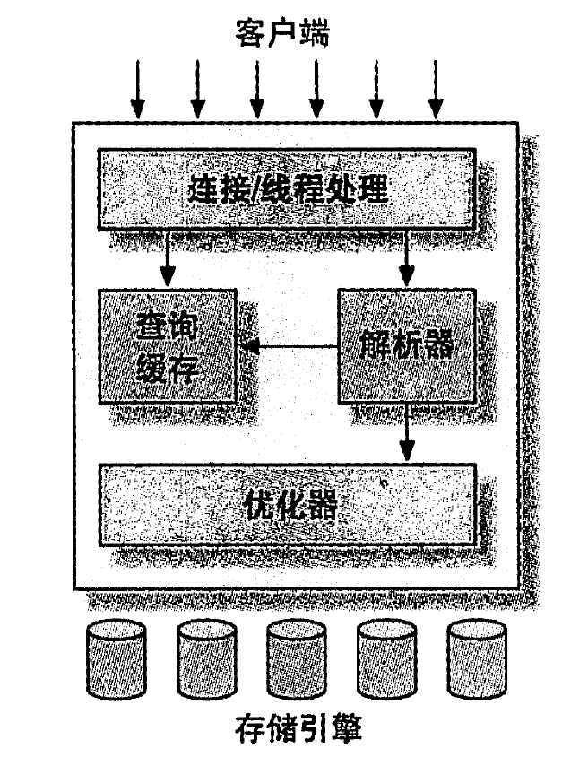
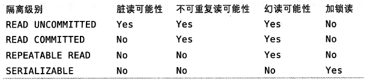

MySQL 架构与历史
---
1. MySQL最重要、最语种不同的特性是它的存储引擎架构，该架构的设计将查询处理以及其他系统任务和数据的存储/提取相分离。

# 1. MySQL的逻辑架构

1. 第一层：连接/线程处理
2. 第二层：MySQL比较有意思的部分，包括查询解析、分析、优化、缓存以及所有的内置函数等，所有跨存储引擎的功能都在本层实现(存储过程、触发器、视图等)
3. 第三层：存储引擎，存储引擎不会解析SQL(InnoDB是一个例外，他会解析外键定义，因为MySQL服务器本身没有实现该功能)

## 1.1. 连接管理与安全性
1. 每个客户端连接都会在服务器进程中拥有一个线程。
2. 服务器负责缓存线程，因此不需要为每一个新建的连接创建或销毁线程：MySQL 5.5或更新版本提供API以支持线程池(Thread-Pooling)插件，可以使用池中的少量线程来服务大量的链接。
3. 服务器认证
   1. SSL方式连接
   2. X.509证书认证
   3. 连接成功后还会检查客户端权限

## 1.2. 优化与执行
1. MySQL会解析查询，并创建内部数据结构(解析树)，然后对其进行各种优化，包括重写查询、决定表的读取顺序，以及选择合适的索引等。
   1. 通过特殊关键字特性(hint)优化器，影响其决策过程
   2. 也可以请求优化器(explain)优化过程的各个因素，使用户可以知道服务器是如何进行优化决策的，并提供一个参考基准，便于用户重构查询和schema、修改相关配置，使应用尽可能高效运行。
2. 优化器并不关心表使用的存储引擎类型，但是存储引擎对优化查询是有影响的。
3. 比如SELECT语句，在解析查询之前，服务器会先检查查询缓存(Query Cache)，如果能够在其中对应的查询，那么不必再执行查询解析、优化和执行的整个过程。

# 2. 并发控制
1. MySQL在两个层面进行并发控制
   1. 服务器层
   2. 存储引擎层

## 2.1. 读写锁
1. 在处理并发读或者写时，可以通过实现一个由两种类型的锁组成的锁系统来解决问题。
2. 这两种类型的锁通常被称为共享锁(share lock)和排它锁(exclusive lock)，也叫做读锁(read lock)和写锁(write lock)
3. 读锁是共享的(互不阻塞)，写锁是排他的(写锁会阻塞其他写操作)
4. 大多数情况下，MySQL锁的内部管理是透明的

## 2.2. 锁粒度
1. 一种提高共享资源并发性的方式是让锁定对象更有选择性：尽量只锁定需要修改的部分数据，而不是所有的资源。更理想的是对修改的数据片进行精确的锁定。
2. 任何时候，在给定的资源上，锁定的数据量越少，则系统的并发程度越高，只要互相不发生冲突导致死锁即可。
3. 加锁需要消耗资源
   1. 获得锁
   2. 检查锁是否已经解除
   3. 释放锁等
4. 锁策略：在锁的开销和数据安全之间寻求平衡，这种平衡也会影响到性能：大多数商业数据库系统一般是在表上施加行级锁(rowlevel locks)
5. MySQL提供更多选择：每一种MySQL存储引擎都可以实现自己的锁策略和锁粒度

### 2.2.1. 表锁 table lock
1. 表锁是MySQL中最基本的锁策略，并且是开销最小的策略。
2. 服务器会为ALTER TABLE之类的语句使用表锁，而忽略存储引擎的锁机制。

### 2.2.2. 行级锁 row lock
1. 行级锁可以最大程度地支持并发处理(同时也带来了最大的锁开销)
2. 行级锁只在存储引擎层(InnoDB XtraDB)实现，而并没有在服务器层实现。

# 3. 事务
1. 事务是一组原子性的SQL查询，或者说一个独立的工作单元。
2. 事务开始:`START TRANSACTION;`，事务结束:`COMMIT;`
3. 系统应该通过严格的ACID(原子性、一致性、隔离性和持久性)，但是这往往要求更强的CPU处理能力、更大的内存和更多的磁盘空间。

## 3.1. ACID

### 3.1.1. 原子性 atomicity
一个事务必须被视为一个不可分割的最小工作单元。

### 3.1.2. 一致性 consistency
数据库总是从一个一致性的状态转换到另一个一致性的状态

### 3.1.3. 隔离性 isolation
一个事务所做的修改在最终提交之前，对其他事务是不可见的

### 3.1.4. 持久性 durability
一旦事务提交，则其所做的修改就会永久的保存到数据库中

## 3.2. 隔离级别
1. MySQL定义了四种隔离级别，每一种级别都规定了一个事务所做的修改，哪些在事务内和事务间可见/不可见，较低级别的隔离通常可以执行更高的并发，系统的开销也更低。

### 3.2.1. READ UNCOMMITED(未提交读)
1. 事务中的修改，即使没有提交，对其他事务也都是可见的，也就是允许脏读(Dirty Read)
2. 性能上并不比其他隔离级别好很多，但是却缺乏其他级别的很多好处，一般很少使用

### 3.2.2. READ COMMITED(提交读)
1. 只能看到已经提交的事务所做的修改，也就是一个事务从开始知道提交前所做的任何修改对其他事务不可见(因此也叫不可重复读)
2. 大多数数据库系统的默认隔离级别(但MySQL不是)。

### 3.2.3. REPEATABLE READ(可重复读)
1. 解决了脏读的问题。该级别保证了在同一个事务中多次读取同样记录的结果是一致的。
2. 但是无法解决幻读(Phantom Read)的问题
   1. 幻读是指某个事务在读取某个范围内的记录时，另一个事务又在改范围内插入了新的记录，当之前的事务再次读取该范围的记录时，会产生幻行(Phantom Row)
   2. InnoDB和XtraDB存储引擎通过多版本并发控制(MVCC，Multiversion Concurrency Control)解决了幻读的问题。
3. 可重复读是MySQL的默认事务隔离级别。

### 3.2.4. SERIALIZABLIE(可串行化)
1. 通过强制事务串行执行，避免了幻读的问题，会为读取的每一行数据加锁，可能会导致大量的超时和锁争用的问题。
   1. 实际应用中也很少用到这个隔离级别
   2. 只有需要确保数据一致性且可以接受没有并发时才考虑
2. 可串行化是最高的隔离级别

## 3.3. 死锁
46页