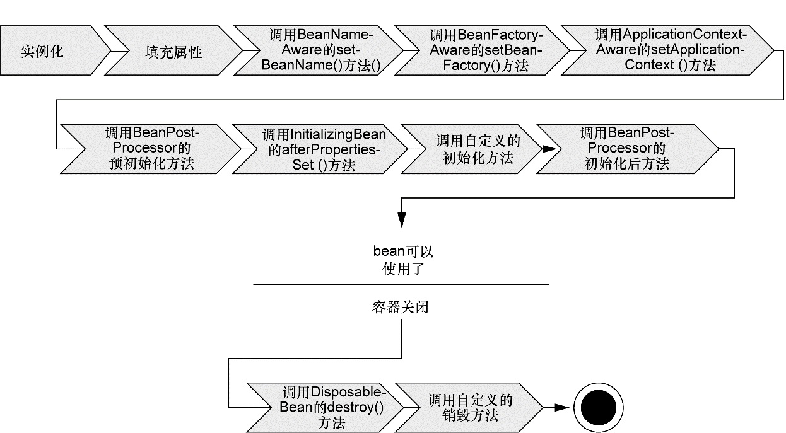

Spring 概述
---
1. 本部分的绝大部分内容参考了《Spring 实战》第四版
2. <a href = "https://potoyang.gitbook.io/spring-in-action-v4/">推荐的电子书</a>

# 1. Spring简化Java开发的4个关键策略
1. 基于POJO的轻量级和最小侵入性编程
2. 通过依赖注入和面向接口实现松耦合
3. 基于切面和惯例进行声明式编程
4. 通过切面和末班减少样板式代码

# 2. 依赖注入
1. 非入侵式编程保证了一个类可以在Spring应用和非Spring 应用中都可以发挥同样的作用。
2. Spring通过DI来装配POJO

## 2.1. DI是如何实现的？
1. DI可以保证对象的依赖关系将由系统中负责协调各对象的第三方组件在创建对象的时候进行设定，而对象无需自行创建或管理它们的依赖关系。
2. 常见的DI方式：构造器注入，常用的方法是mock实现，将构造器传入的对象使用mock实现即可(结合mockito框架)
3. 如何工作？Spring通过应用上下文(Application Context)来装载bean的定义并把它们组装起来

## 2.2. 装配：创建应用组件之间协作的行为
1. 使用XML来完成装配

```xml
<?xml version="1.0" encoding="UTF-8"?>
<beans xmlns="http://www.springframework.org/schema/beans"
  xmlns:xsi="http://www.w3.org/2001/XMLSchema-instance"
  xsi:schemaLocation="
    http://www.springframework.org/schema/beans 
    http://www.springframework.org/schema/beans/spring-beans.xsd">

  <bean id="knight" class="sia.knights.BraveKnight">
    <constructor-arg ref="quest" />
  </bean>

  <bean id="quest" class="sia.knights.SlayDragonQuest">
    <constructor-arg value="#{T(System).out}" />
  </bean>

</beans>
```

2. 使用Java配置来描述

```java
package sia.knights.config;

import org.springframework.context.annotation.Bean;
import org.springframework.context.annotation.Configuration;

import sia.knights.BraveKnight;
import sia.knights.Knight;
import sia.knights.Quest;
import sia.knights.SlayDragonQuest;

@Configuration
public class KnightConfig {

  @Bean
  public Knight knight() {
    return new BraveKnight(quest());
  }
  
  @Bean
  public Quest quest() {
    return new SlayDragonQuest(System.out);
  }

}
```

# 3. 面向切面编程 AOP
1. 面向切面编程允许你把遍布应用各处的功能分离出来形成可重用的组件
2. 部分组件承担着额外的职责，比如日志、事务管理和安全等系统服务，这些系统服务常常被称为**横切关注点**，而AOP可以保证这些服务模块化，以声明的方式将他们应用到需要影响的组件中。
3. 切面的声明方式(XML)

```xml
<?xml version="1.0" encoding="UTF-8"?>
<beans xmlns="http://www.springframework.org/schema/beans"
  xmlns:xsi="http://www.w3.org/2001/XMLSchema-instance"
  xmlns:aop="http://www.springframework.org/schema/aop"
  xsi:schemaLocation="http://www.springframework.org/schema/aop 
  http://www.springframework.org/schema/aop/spring-aop.xsd
  http://www.springframework.org/schema/beans 
  http://www.springframework.org/schema/beans/spring-beans.xsd">

  <bean id="knight" class="sia.knights.BraveKnight">
    <constructor-arg ref="quest" />
  </bean>

  <bean id="quest" class="sia.knights.SlayDragonQuest">
    <constructor-arg value="#{T(System).out}" />
  </bean>

  <bean id="minstrel" class="sia.knights.Minstrel">
    <constructor-arg value="#{T(System).out}" />
  </bean>

  <aop:config>
    <aop:aspect ref="minstrel">
      <aop:pointcut id="embark"
          expression="execution(* *.embarkOnQuest(..))"/>
        
      <aop:before pointcut-ref="embark" 
          method="singBeforeQuest"/>

      <aop:after pointcut-ref="embark" 
          method="singAfterQuest"/>
    </aop:aspect>
  </aop:config>
  
</beans>
```

# 4. 使用模板消除样式代码
1. JDBC、JMS、JNDI、REST等等都存在有大量的样式代码
2. 简单的例子：JDBC的模板：jdbcTemplate

# 5. Bean
1. 在基于Spring的应用中，应用对象生存于Spring容器(container)中，Spring容器负责创建对象并装配，配置它们并管理它们的整个生活周期，从new到finalize()
2. Spring容器不同类型
   1. bean工厂(org.springframework.beans.factory.BeanFactory)提供DI的支持
   2. 应用上下文(org.springframework.context.ApplicationContext)基于BeanFactory构建，并提供应用框架级别的服务。

## 5.1. 应用上下文 Application Context
1. 多种应用上下文：区别在于如何装载配置
   1. AnnotationConfigApplicationContext：从一个或多个基于Java的配置类中加载Spring应用上下文。
   2. AnnotationConfigWebApplicationContext：从一个或多个基于Java的配置类中加载Spring Web应用上下文。
   3. ClassPathXmlApplicationContext：从类路径下的一个或多个XML配置文件中加载上下文定义，把应用上下文的定义文件作为类资源。
   4. FileSystemXmlapplicationcontext：从文件系统下的一个或多个XML配置文件中加载上下文定义。
   5. XmlWebApplicationContext：从Web应用下的一个或多个XML配置文件中加载上下文定义。
2. 上下文准备就绪后，我们就可以调用上下文的getBean()从容器中获取Bean

## 5.2. Bean的生命周期


1. Spring对bean进行**实例化**
2. Spring将值和bean的引用注入到bean对应的属性中
3. 如果bean实现了BeanNameAware接口，Spring将bean的ID传递给setBeanName()方法
4. 如果bean实现了BeanFactoryAware接口，Spring将调用 setBeanFactory()方法，将BeanFactory容器实例传入
5. 如果bean实现了ApplicationContextAware接口，Spring 将调用setApplicationContext()方法，将bean所在的应用上下文的引用传入进来；
6. 如果bean实现了BeanPostProcessor接口，Spring 将调用它们的postProcessBefore-Initialization()方法；
7. 如果bean实现了InitializingBean接口，Spring 将调用它们的afterPropertiesSet()方法。类似地，如果bean使用 initmethod声明了初始化方法，该方法也会被调用；
8. 如果bean实现了BeanPostProcessor接口，Spring将调用它们的postProcessAfter-Initialization()方法；
9. 此时，bean已经准备就绪，可以被应用程序使用了，它们将一直驻留在应用上下文中，直到该应用上下文被销毁；
10. 如果bean实现了DisposableBean接口，Spring 将调用它的destroy()接口方法：如果destroy-method声明了销毁方法，则该方法也会被调用。

